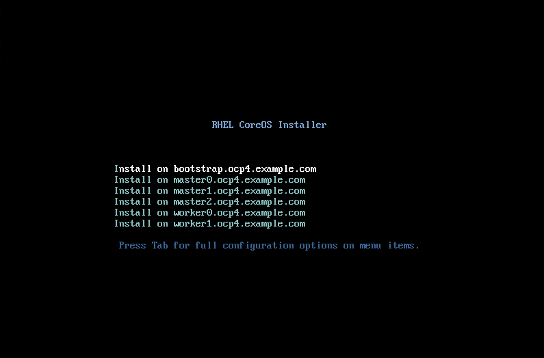

# RHCOS ISO Maker

You can create a custom ISO using [Chuckers' ISO Maker repo](https://github.com/chuckersjp/coreos-iso-maker). This playbook will create a single ISO that has a menu entry for each component (bootstrap/masters/workers).

Although very useful, with my opinionated playbook and his opinionated playbook; it makes it difficult to incorporate it within my playbook. Therefore, I've created this little "how to use the ISO maker with the helpernode".

> :rotating_light: Although this should work with a "compact cluster", CoreOS-ISO-Maker was built with a "full cluster" in mind. YMMV

## Cloning The Repo

I assume you've done all the steps up to (and including) [creating the ignition files](https://github.com/RedHatOfficial/ocp4-helpernode/blob/master/docs/quickstart-static.md#create-ignition-configs). After the ignition files have been created and copied over to your webserver, clone the ISO maker repo.

```
cd ~
git clone https://github.com/chuckersjp/coreos-iso-maker
cd coreos-iso-maker
```

## Configuring ISO Maker

Onced cloned, you'll need to modify the `group_vars/all.yml` file to match your environment.

```yaml
---
gateway: 192.168.7.1
netmask: 255.255.255.0
interface: ens3
dns: 
  - 192.168.7.77
  - 192.168.7.1
webserver_url: 192.168.7.77
webserver_port: 8080
install_drive: vda

ocp_version: 4.5.2
iso_checksum: 48e3cbbb632795f1cb4a5713d72c30b438a763468495db69c0a2ca7c7152856a
iso_name: rhcos-{{ ocp_version }}-x86_64-installer.x86_64.iso
rhcos_bios: bios.raw.gz
...
```

Few things to note:

* `iso_name` is found on the [mirror site](https://mirror.openshift.com/pub/openshift-v4/dependencies/rhcos/)
* `iso_checksum` is another thing you need to change that can also be found on the [OpenShift Mirror](https://mirror.openshift.com/pub/openshift-v4/dependencies/rhcos/) in the `sha256sum.txt` file.
* `rhcos_bios` is the name of your bios file on the helpernode.

You also need to edit the `inventory.yml` file based on your environment.

```
---
all:
  children:
    bootstrap:
      hosts:
        bootstrap.ocp4.example.com:
          ipv4: 192.168.7.20
    
    masters:
      hosts:
        master0.ocp4.example.com:
          ipv4: 192.168.7.21

        master1.ocp4.example.com:
          ipv4: 192.168.7.22

        master2.ocp4.example.com:
          ipv4: 192.168.7.23
        
    workers:
      hosts:
        worker0.ocp4.example.com:
          ipv4: 192.168.7.11

        worker1.ocp4.example.com:
          ipv4: 192.168.7.12
...
```

## HelperNode Hacking Required

You'll need to move some stuff around where the ISO maker expects them to find them.

```
cp /var/www/html/install/bios.raw.gz /var/www/html/
cp /var/www/html/ignition/*.ign /var/www/html/
ln -s /var/www/html/worker.ign /var/www/html/workers.ign
ln -s /var/www/html/master.ign /var/www/html/masters.ign
chmod o+r /var/www/html/*
restorecon -vR /var/www/html
```

## Run The Playbook

Now run the playbook.

```
ansible-playbook playbook-single.yml
```

The playbook will create the ISO file `/tmp/rhcos_install-cluster.iso`. You can use this to boot all your nodes.

## Booting Into ISO

When you boot into this ISO, you'll be greeted with the following menu.



Choose the correct option for the server you're installing. I would boot them in the following order: bootstrap, masters, and then workers.

## Success

Once you've booted into the right option, RHCOS will install with the right IP address.

You're now ready to continue with [the next step](https://github.com/RedHatOfficial/ocp4-helpernode/blob/master/docs/quickstart-static.md#wait-for-install) of the install.
